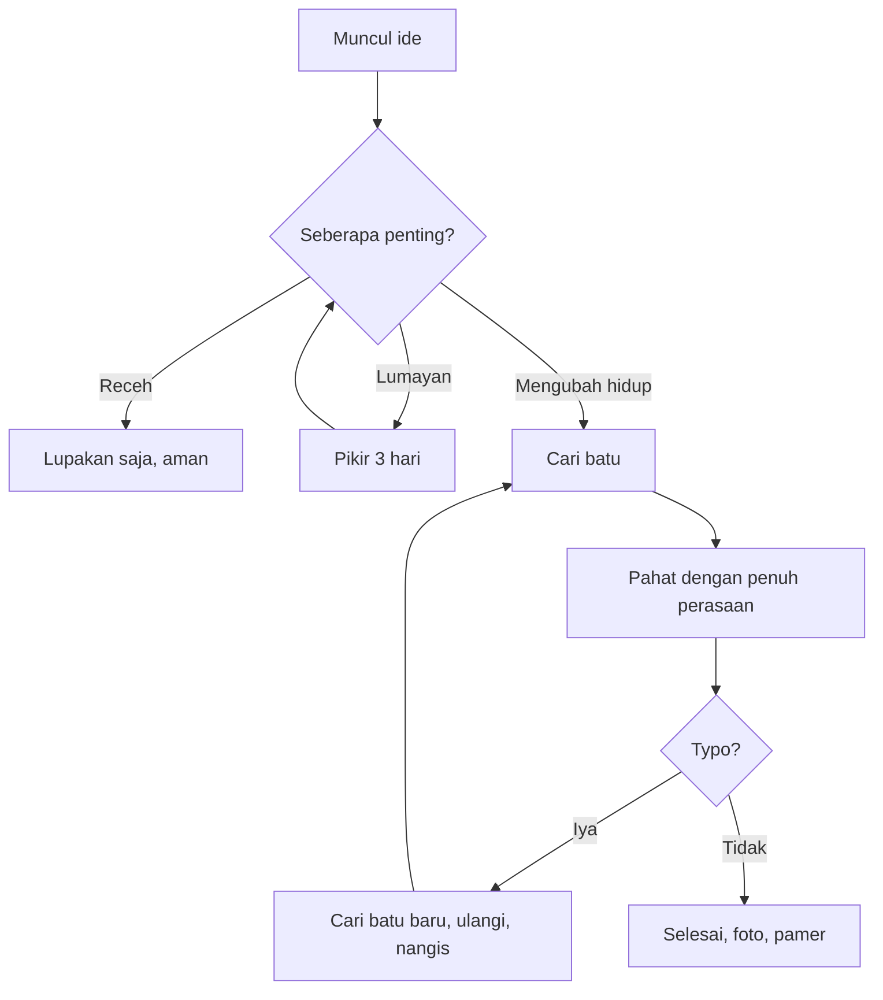

<!-- Komentar tersembunyi: kalau lo baca ini, berarti lo buka source-nya. Respect. Batu juga suka orang yang penasaran. -->

# Catat di Atas Batu

### Kenapa Ide, Rencana, dan Daftar Belanja Lo Pantas Dipahat, Bukan Diketik


> Dokumen ini ditulis dengan serius, tapi isinya nggak. Kalau lo merasa tersinggung, silakan catat rasa tersinggung itu di atas batu. Biar abadi.

---

## Daftar Isi

1. [Pendahuluan: Masalahnya Apa Sih](#pendahuluan-masalahnya-apa-sih)
2. [Tersangka Utama: Kertas dan Aplikasi Note](#tersangka-utama-kertas-dan-aplikasi-note)
3. [Adu Fitur: Tabel Perbandingan](#adu-fitur-tabel-perbandingan)
4. [Sepuluh Alasan Batu Menang](#sepuluh-alasan-batu-menang)
5. [Arsitektur Sistem Pencatatan Batu](#arsitektur-sistem-pencatatan-batu)
6. [Cara Memulai](#cara-memulai)
7. [Testimoni Pengguna](#testimoni-pengguna)
8. [FAQ](#faq)
9. [Catatan Kaki dan Penutup](#catatan-kaki-dan-penutup)

---

## Pendahuluan: Masalahnya Apa Sih

Pernah nggak lo punya ide brilian jam 2 pagi, lo catat di kertas, terus paginya kertas itu ilang entah ke dimensi mana? Atau lo catat di aplikasi note, terus aplikasinya minta lo login, lo lupa password, reset password, emailnya masuk spam, spam-nya penuh, dan akhirnya lo lupa idenya apa?

Nah. Itu semua terjadi karena lo mencatat di media yang **rapuh**, **fana**, dan **penuh drama**.

Sementara itu, batu:

- Nggak pernah minta lo login.
- Nggak pernah bilang "Kami telah memperbarui Syarat dan Ketentuan kami".
- Nggak pernah *crash* pas lo lagi nulis hal penting.
- Sudah ada sejak zaman dinosaurus dan masih fine-fine aja.

### Tesis Utama

Mencatat di atas batu itu ~~repot~~ **investasi jangka panjang**. Satu catatan, seumur hidup. Bahkan umur anak cucu lo, kalau mereka kuat angkat.

---

## Tersangka Utama: Kertas dan Aplikasi Note

### Kertas

Kertas itu manis di awal, pahit di belakang. Mari kita bedah dosanya.

#### Dosa-dosa kertas

- Mudah **robek**, apalagi kalau ada kucing.
- Mudah **basah**, apalagi kalau ada kopi.
- Mudah **hilang**, apalagi kalau ada emak yang lagi beres-beres rumah.
- Mudah **dialihfungsikan**:
  - Jadi bungkus gorengan
  - Jadi pesawat-pesawatan
  - Jadi alas tumpahan minyak
    - Termasuk catatan ide startup lo yang bakal jadi unicorn

##### Tingkat kerusakan

###### Dan yang paling parah: rayap. Rayap nggak punya hati.

### Aplikasi Note

Aplikasi note itu seperti pacar yang manis di awal, lalu mulai minta uang.

1. Awalnya gratis.
2. Terus ada fitur "Premium".
3. Terus catatan lama lo "diarsipkan" ke tier berbayar.
4. Terus startup-nya bangkrut.
5. Terus semua catatan lo ikut menguap bersama server yang dimatikan.
   1. Lo kirim email ke support.
   2. Support-nya adalah bot.
   3. Bot-nya juga udah dimatikan.

---

## Adu Fitur: Tabel Perbandingan

| Fitur                   | Kertas              | Aplikasi Note              | Batu                          |
|:------------------------|:-------------------:|:--------------------------:|------------------------------:|
| Daya tahan              | Hitungan bulan      | Selama server hidup        | Ribuan tahun                  |
| Butuh baterai           | Tidak               | Iya, dan selalu sekarat    | Tidak, tapi butuh otot        |
| Butuh internet          | Tidak               | Iya                        | Tidak, kecuali mau pamer      |
| Biaya langganan         | Rp0                 | Rp49.000/bulan             | Rp0 (batu di sungai gratis)   |
| Fitur *undo*            | Tip-Ex              | `Ctrl+Z`                   | Tidak ada, makanya mikir dulu |
| Dark mode               | Tidak               | Iya                        | Default dari pabrik alam      |
| Tahan air               | Tidak               | Tergantung HP lo           | Justru makin estetik          |
| Tahan api               | Tidak               | Tidak                      | Iya                           |
| Tahan ditimpa galon     | Tidak               | Tidak                      | Galon-nya yang retak          |
| Notifikasi mengganggu   | Tidak               | Banyak                     | Nol                           |
| Autosave                | Tidak               | Iya                        | Iya, permanen                 |
| Dipakai ganjal pintu    | Bisa, tapi nggak kuat | Nggak masuk akal         | Multifungsi, anjay            |

> Catatan: skor akhir tidak dicantumkan karena batu menang telak dan itu bikin kolom lain sedih.

---

## Sepuluh Alasan Batu Menang

1. **Tidak bisa di-*hack*.** Peretas paling jago sekalipun harus datang langsung ke rumah lo, dan itu terlalu banyak usaha.
2. **Tidak ada *sync conflict*.** Cuma ada satu versi kebenaran, dan beratnya 14 kilogram.
3. **Tidak ada *bloatware*.** Batu nggak akan tiba-tiba menawarkan fitur AI untuk "merangkum" catatan lo yang cuma tiga kata.
4. **Aman dari *shoulder surfing*.** Orang nggak bisa ngintip catatan lo dari belakang kalau lo udah nutupin pakai badan sambil memahat.
5. **Memaksa lo jadi ringkas.** Nulis "Beli telur" di batu itu capek. Nulis "Hari ini gue merenungkan kehidupan dan juga telur" itu bunuh diri.
6. **Nilai estetika.** Foto catatan lo di batu bakal dapat lebih banyak *like* daripada foto kopi lo.
7. **Bonus latihan fisik.** Memahat itu kardio. Mengangkat itu *strength training*. Catatan lo sekalian jadi *gym*.
8. **Catatan jadi sakral.** Kalau lo udah mau pahat sesuatu, berarti itu beneran penting.
9. **Warisan.** Anak cucu lo nggak akan nemu folder `catatan_final_v2_REVISI_beneran.docx`. Mereka bakal nemu batu. Dan mereka akan kagum.
10. **Nggak bisa lupa naruh di mana.** Karena lo nggak bakal sanggup bawa-bawa batu. Jadi dia selalu ada di tempat yang sama. Hebat.

---

## Arsitektur Sistem Pencatatan Batu

Berikut alur kerja standar yang direkomendasikan oleh komunitas pemahat nggak resmi sedunia.



### Pseudocode

Kalau lo programmer dan butuh pendekatan yang familiar:

```python
class Catatan:
    def __init__(self, isi: str, batu: Batu):
        self.isi = isi
        self.batu = batu

    def simpan(self):
        if len(self.isi) > 20:
            raise Exception("Terlalu panjang. Pangkas atau ganti batu yang lebih gede.")
        self.batu.pahat(self.isi)
        return "Tersimpan selamanya. Nggak ada tombol hapus. Selamat."

ide = Catatan("Beli telur", Batu(berat_kg=3))
print(ide.simpan())
```

Atau versi shell buat yang suka drama:

```bash
$ cari_batu --ukuran sedang --permukaan rata
Batu ditemukan di pinggir kali.

$ pahat "Jangan lupa bayar listrik" --kedalaman 2cm
ERROR: Tangan lecet. Lanjut? [y/N]
```

Perubahan konfigurasi hidup sebelum dan sesudah pindah ke batu:

```diff
- Buka 5 aplikasi note berbeda
- Login ulang tiap minggu
- Lupa catatan penting
+ Satu batu
+ Satu catatan
+ Satu penyesalan kalau salah ketik
```

Contoh konfigurasi `batu.yaml`, kalau suatu hari ada yang bikin standar internasionalnya:

```yaml
catatan:
  media: batu
  jenis: andesit
  bahasa: Indonesia
  fitur_undo: false
  backup:
    metode: bikin batu kembar
    frekuensi: pas lagi rajin
```

Dan data JSON, supaya terlihat profesional:

```json
{
  "judul": "Ide jualan seblak rasa durian",
  "status": "dipahat",
  "bisa_dihapus": false,
  "penyesalan": "tinggi"
}
```

Inline code juga boleh: pakai `git commit -m "pahat catatan baru"` kalau lo mau melacak riwayat, tapi yang di-commit ya foto batunya aja.

### Rumus Kebahagiaan

Berat catatan berbanding lurus dengan keseriusan niat lo. Secara matematis:

$$
K = \frac{I \times B}{L}
$$

Di mana $K$ adalah keseriusan, $I$ adalah tingkat ide, $B$ adalah berat batu, dan $L$ adalah level kemalasan lo. Kalau $L$ mendekati nol, itu artinya lo orang langka. Hubungi kami.

---

## Cara Memulai

### Perlengkapan

- [x] Batu (jangan yang udah ada lumutnya, kecuali lo memang mau gaya *vintage*)
- [x] Pahat atau paku besar
- [x] Palu (atau batu lain, boleh, dunia ini penuh batu)
- [x] Kacamata pelindung, karena mata lo cuma dua
- [ ] Kesabaran (stok sedang habis, cek lagi nanti)
- [ ] Rencana kalau salah ketik

### Langkah-langkah

1. Pilih batu. Perlakukan seperti memilih semangka: ketuk-ketuk dan tanyakan dalam hati, "Kamu siap menyimpan rahasiaku?"
2. Bersihkan permukaan.
3. Tentukan isi catatan. Singkat, padat, jangan curhat.
4. Pahat pelan-pelan.
   - Jangan buru-buru.
   - Jangan melamun.
   - Jangan pahat sambil nonton drama Korea.
5. Foto hasilnya sebagai bukti.
6. Simpan batunya di tempat yang aman, dan jangan sampai kena kaki.

### Pintasan Papan Ketik

Karena kita masih manusia modern yang punya laptop, berikut pintasan yang berguna selama masa transisi:

| Pintasan                              | Fungsi                                      |
|---------------------------------------|---------------------------------------------|
| <kbd>Ctrl</kbd> + <kbd>S</kbd>        | Menyimpan. Nggak berlaku di batu.           |
| <kbd>Ctrl</kbd> + <kbd>Z</kbd>        | Undo. Juga nggak berlaku di batu. Maaf.     |
| <kbd>Alt</kbd> + <kbd>F4</kbd>        | Menutup jendela, bukan menutup hidup.       |

---

## Testimoni Pengguna

> "Dulu gue nyatet semua di HP. Sekarang gue nyatet di batu. Hidup gue berubah, dan bahu gue juga."
>
> **Budi, 29 tahun, mantan pengguna 7 aplikasi note**

> "Aku pernah nyimpen resep rahasia nenek di aplikasi. Aplikasinya tutup. Resepnya hilang. Nenekku marah."
>
> > "Kalau dipahat di batu, aku bisa tunjukin ke nenek dengan bangga."
> >
> > > "Terus nenekku nimpuk aku pakai batunya."
>
> **Sari, 24 tahun, cucu yang kurang beruntung**

> "Saya bukan orang teknologi, tapi saya paham batu."
>
> **Pak Joko, tukang bangunan, 52 tahun**

---

## FAQ

<details>
<summary>Gimana kalau gue salah pahat?</summary>

Selamat, lo baru aja belajar pelajaran hidup yang paling mahal. Opsi lo cuma tiga:

1. Ubah salahnya jadi fitur.
2. Cari batu baru.
3. Pura-pura itu memang sengaja, dan sebut aja "gaya abstrak".

</details>

<details>
<summary>Gimana cara nge-share catatan ke teman?</summary>

Ada dua cara: foto lalu kirim via chat, atau kirim batunya via ekspedisi. Cara kedua lebih puitis, tapi ongkirnya dihitung per kilogram.

</details>

<details>
<summary>Gimana cara nyari catatan lama?</summary>

Fitur pencarian di batu menggunakan teknologi canggih bernama **mata** dan **ingatan**. Kalau gagal, upgrade ke versi **lutut**: jongkok dan cari di kolong.

</details>

<details>
<summary>Apakah ini serius?</summary>

Sebagian. Bagian yang mana, terserah lo.

</details>

### Daftar Istilah

<dl>
  <dt>Pahat</dt>
  <dd>Aksi menyimpan data secara permanen, sambil mempertaruhkan jari.</dd>

  <dt>Backup</dt>
  <dd>Batu kedua yang isinya sama persis dengan batu pertama, dan sama beratnya.</dd>

  <dt>Cloud</dt>
  <dd>Tempat yang bukan di batu. Mencurigakan.</dd>
</dl>

---

## Catatan Kaki dan Penutup

Beberapa hal yang perlu diklarifikasi demi kejelasan ilmiah.[^1] Ada juga beberapa disclaimer yang sengaja ditaruh di bawah, karena kalau ditaruh di atas nggak ada yang baca.[^2]

H<sub>2</sub>O tetap penting, tapi catatan soal H<sub>2</sub>O sebaiknya dipahat di batu yang tahan air. Dan kalau lo menghitung 2<sup>10</sup> batu, itu 1024 batu, yang artinya lo butuh gudang. Teks yang <mark>di-highlight</mark> itu penting, sedangkan teks yang ~~dicoret~~ itu pernah penting. Ada juga teks yang ***tebal dan miring sekaligus***, biasanya untuk hal yang sangat dramatis seperti "BAYAR UTANG".

Kalau lo perlu menulis karakter spesial tanpa dirender, pakai backslash: \*bukan miring\*, \# bukan judul, \[bukan tautan\].

Satu baris di sini  
dipotong paksa dengan dua spasi,  
supaya jadi seperti puisi yang nggak punya arah.

### Tautan yang Mungkin Berguna

- Tautan biasa: [Sungai terdekat](https://www.google.com/maps/search/sungai+terdekat)
- Tautan dengan tooltip: [Toko bangunan](https://www.google.com/maps/search/toko+bangunan "Beli pahat di sini")
- Tautan referensi: baca [dokumentasi Markdown][md-docs] kalau lo penasaran kenapa README ini rapi.
- Tautan otomatis: <https://example.com>
- Gambar yang bisa diklik: [](https://example.com)

### Lisensi

Dokumen ini dilisensikan di bawah **Lisensi Batu Bebas** (LBB): lo boleh pakai, ubah, dan sebarkan, asal nggak dilempar ke orang.

---

<p align="center">
  <i>Dibuat dengan kopi, bosan, dan niat yang agak berlebihan.</i><br>
  <b>Pahat dulu, nyesel belakangan.</b>
</p>

[^1]: Tidak ada batu yang disakiti dalam pembuatan dokumen ini. Beberapa jempol, mungkin.
[^2]: Penulis tidak bertanggung jawab atas jari lecet, batu retak, tetangga yang terganggu suara palu jam 5 pagi, maupun pasangan yang tiba-tiba minta putus karena lo lebih sibuk sama batu.

[md-docs]: https://www.markdownguide.org "Markdown Guide"
